<div align="center">

# DevCockpit — Board, Timer, Day


**A board-first Chrome extension that's your whole workday on one tab.**
A slim top bar carries a Pomodoro timer, today's calendar, the weather, and your Slack +
Gmail unread counts. The rest of the page switches between **Boards**, **Ideas**, and **News**.
The whole interface speaks **English or Polish** — switch any time, no reload.

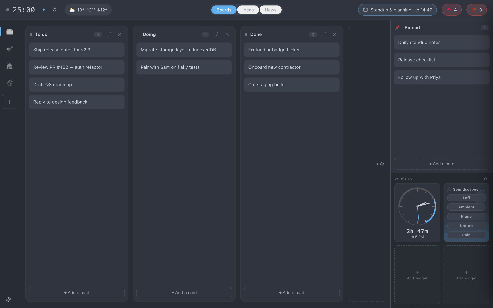

<sub>Shown in the built-in **Zed (One Dark)** theme. DevCockpit ships nine themes and nine accent colors — see [Themes](#-themes--appearance).</sub>

</div>

---

## The top bar, up close

Everything you need to glance at, always on, across every view.

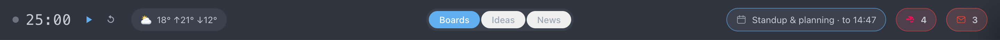

### Three views, one keystroke away

Press **1 / 2 / 3** (or use the centre switcher) to swap the whole main area. The timer and
the calendar / weather / Slack / Gmail pills stay live across all three. Your last view is remembered.

<table>
<tr>
<td width="33%">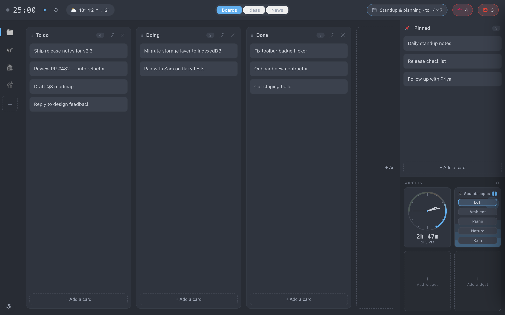<br><div align="center"><b>1 · Boards</b><br><sub>Trello-style multi-board</sub></div></td>
<td width="33%">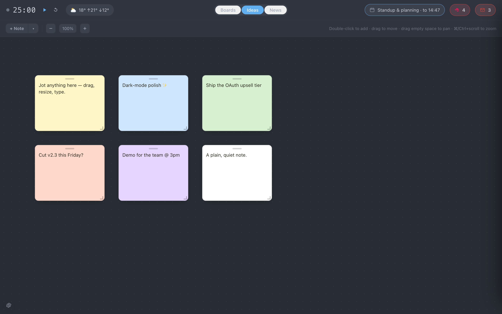<br><div align="center"><b>2 · Ideas</b><br><sub>Free-form sticky canvas</sub></div></td>
<td width="33%">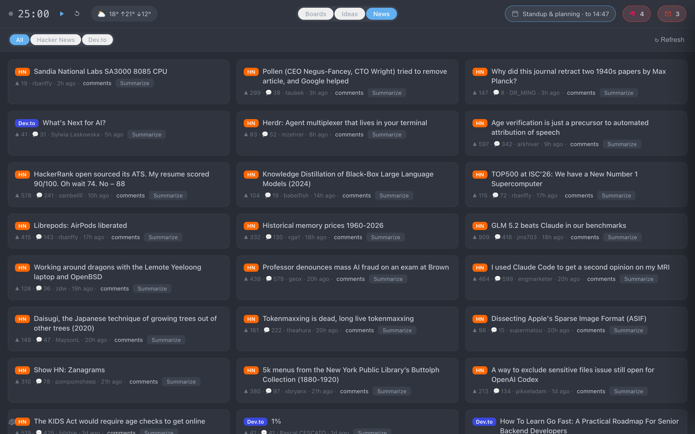<br><div align="center"><b>3 · News</b><br><sub>HN + Dev.to feed</sub></div></td>
</tr>
</table>

---

## ⏱️ Timer

Just the number and three controls in the bar — start/pause, reset, and (in settings) the phase
lengths. Focus ↔ break only. A chime plays at every transition (pitch nudges down into a break, up
back to focus), and the remaining time shows on the toolbar icon — **ember** while focusing,
**sage** during a break, grey when paused.

<table>
<tr>
<td width="33%">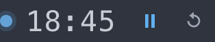<br><div align="center"><sub>Focusing</sub></div></td>
<td width="33%">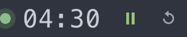<br><div align="center"><sub>On a break</sub></div></td>
<td width="33%">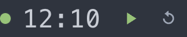<br><div align="center"><sub>Paused</sub></div></td>
</tr>
</table>

Set the phase lengths, chime and alerts in settings — and press **?** anywhere for the full shortcut list.

<table>
<tr>
<td width="55%" valign="top">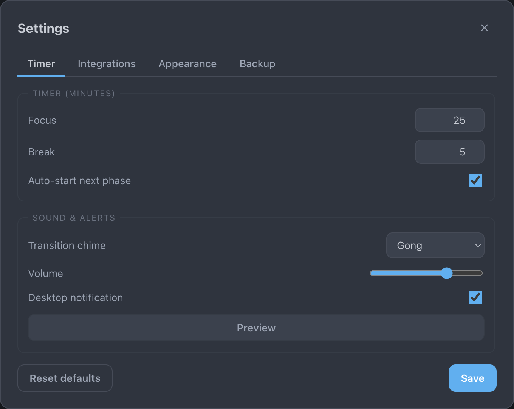<br><div align="center"><sub>Timer settings</sub></div></td>
<td width="45%" valign="top">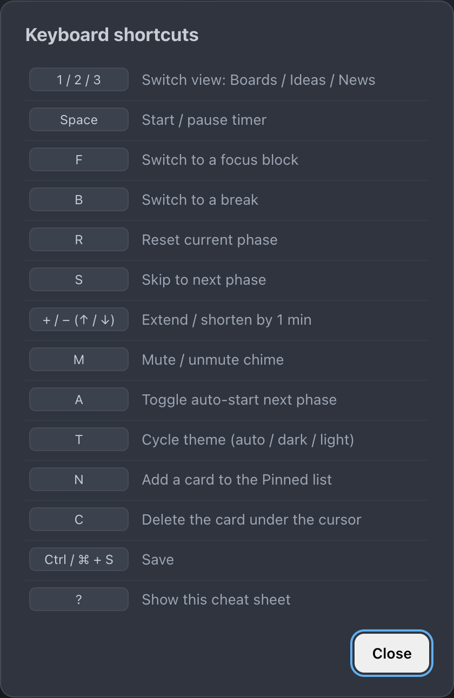<br><div align="center"><sub>Press <b>?</b> for the cheat-sheet</sub></div></td>
</tr>
</table>

<sub>**Keyboard:** **Space** start/pause · **R** reset · **S** skip phase · **F** focus · **B** break ·
**+ / −** (or **↑ / ↓**) ±1 min · **M** mute · **A** auto-start · **T** cycle theme · **N** card to Pinned ·
**1 / 2 / 3** switch view · **?** all shortcuts.</sub>

---

## 🗓️ Calendar · 🌦️ Weather · 💬 Slack · ✉️ Gmail

Each pill shows a glanceable summary; click it for the full panel. All four are optional and
configured in settings — until then they show a quiet "connect" hint and everything else works.

<table>
<tr>
<td width="50%" valign="top">
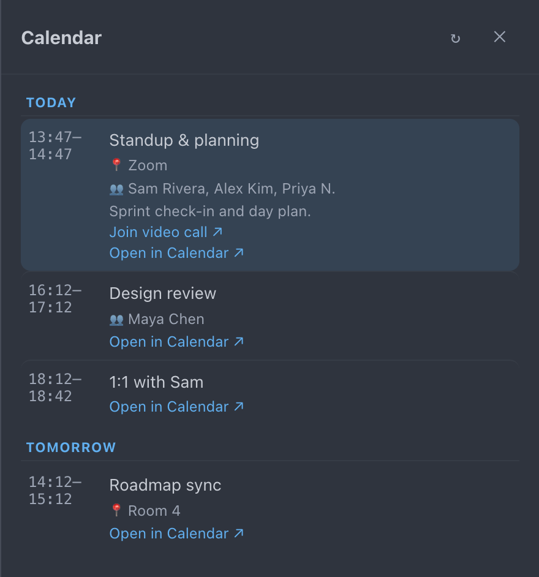
<div align="center"><b>Calendar</b> — today & tomorrow, split into two sections. An in-progress meeting outlines the pill and shows a Join link, attendees, and location.</div>
</td>
<td width="50%" valign="top">
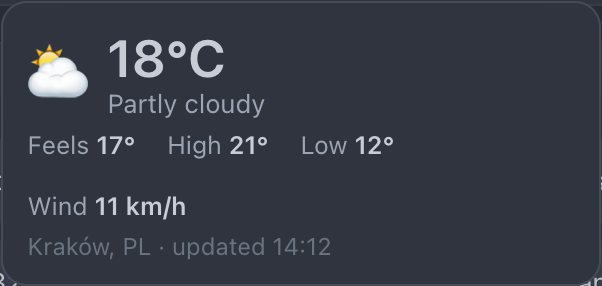
<div align="center"><b>Weather</b> — current temp with the day's high (↑) and low (↓) in the pill; feels-like, high/low and wind on click. Keyless (Open-Meteo).</div>
<br>
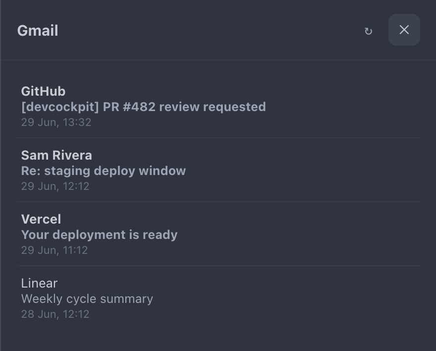
<div align="center"><b>Gmail</b> — inbox unread count; the panel lists unread senders/subjects. Read-only <code>gmail.metadata</code> — counts only, never message contents.</div>
</td>
</tr>
</table>

### AI helpers in the Slack panel <sub>(optional, your own Anthropic key)</sub>

The Slack panel shows your unread DMs + @mentions. With an Anthropic API key, every message gains
two buttons: **Wyjaśnij (PL)** explains it in Polish, and **Odpowiedz (EN)** drafts a ready-to-send
English reply you can copy.

<table>
<tr>
<td width="50%" valign="top">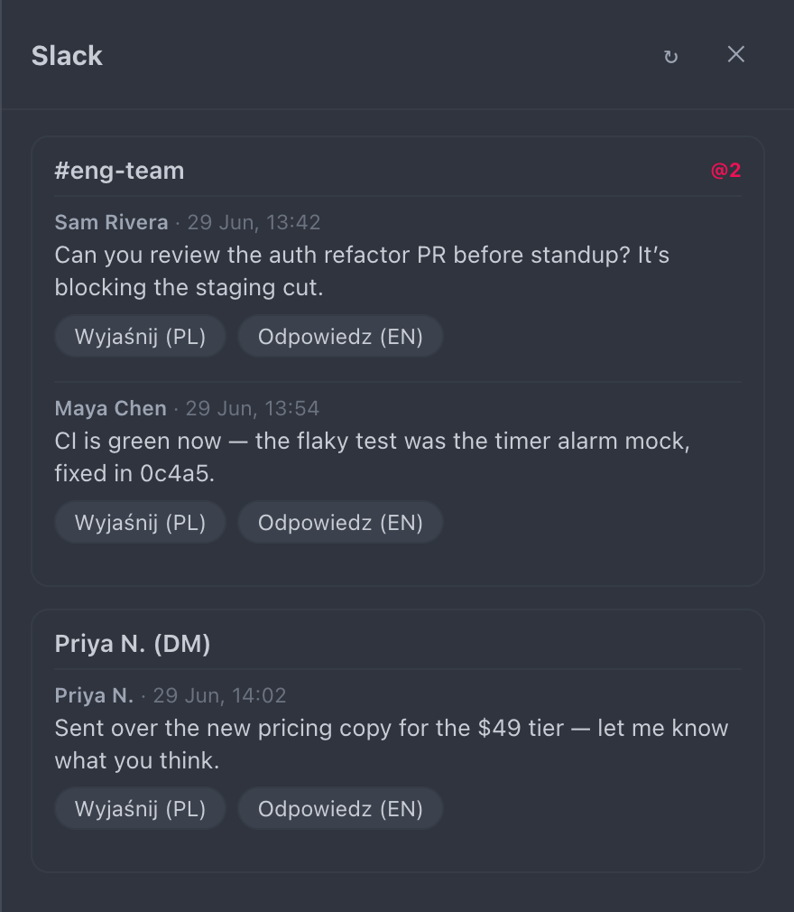<br><div align="center"><sub>Unread conversations with mention badges</sub></div></td>
<td width="50%" valign="top">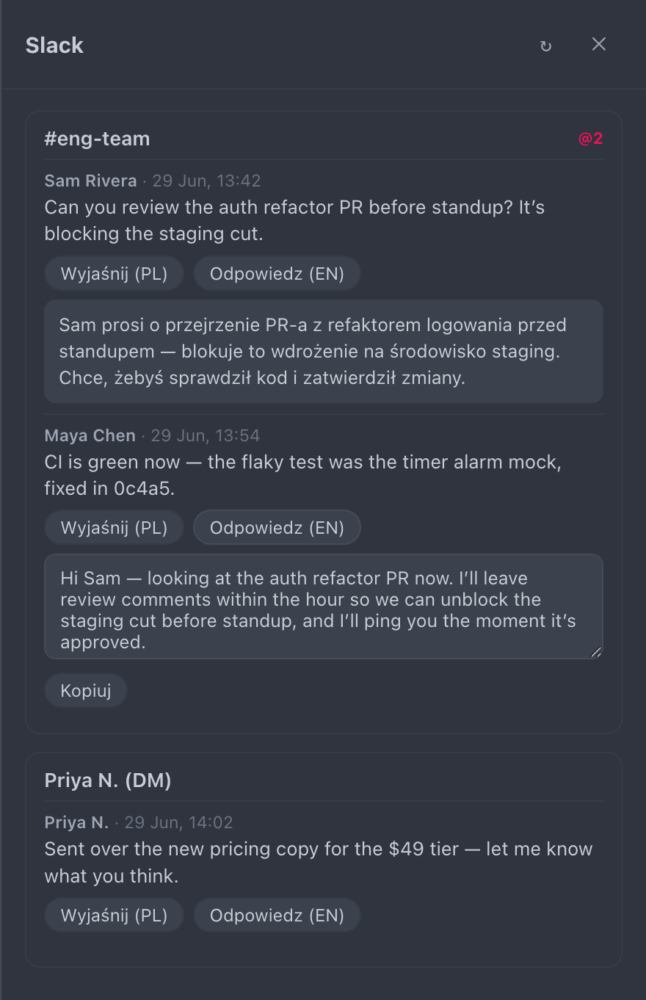<br><div align="center"><sub>Wyjaśnij (PL) explanation + Odpowiedz (EN) draft</sub></div></td>
</tr>
</table>

---

## 🗂️ Boards

A full-screen, Trello-style multi-board. Drag cards within and between lists, grab the **⠿** handle
to reorder lists, and use **⤴** to move a whole list to another board. Keep several boards on the
left rail; a **Pinned** list on the right stays visible on every board with its own widget tray below.

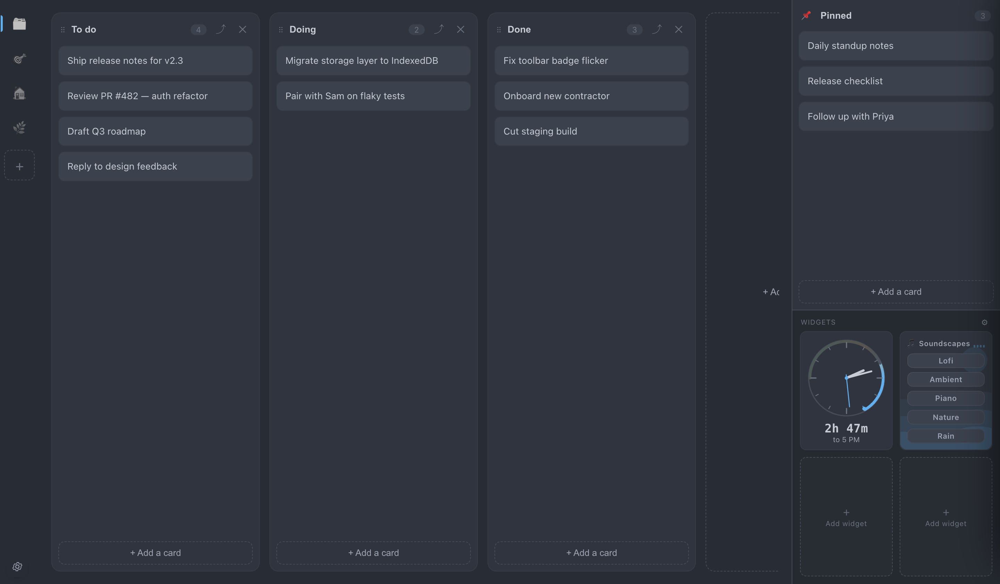

<table>
<tr>
<td width="50%" valign="top">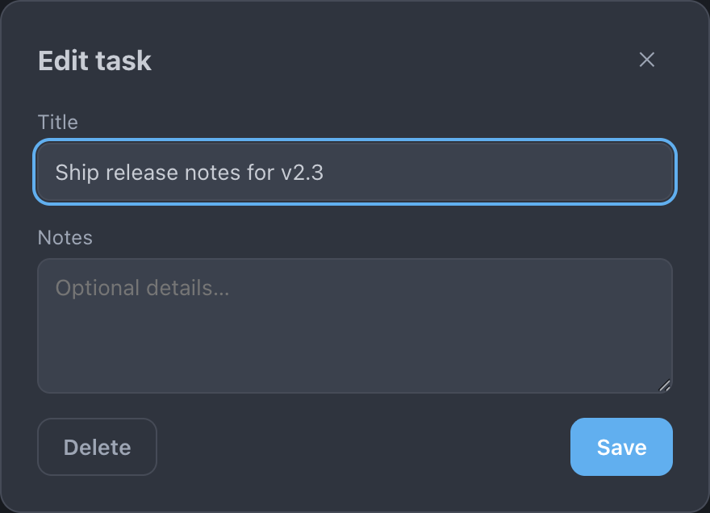<br><div align="center"><sub>Click a card to edit its title & notes</sub></div></td>
<td width="50%" valign="top">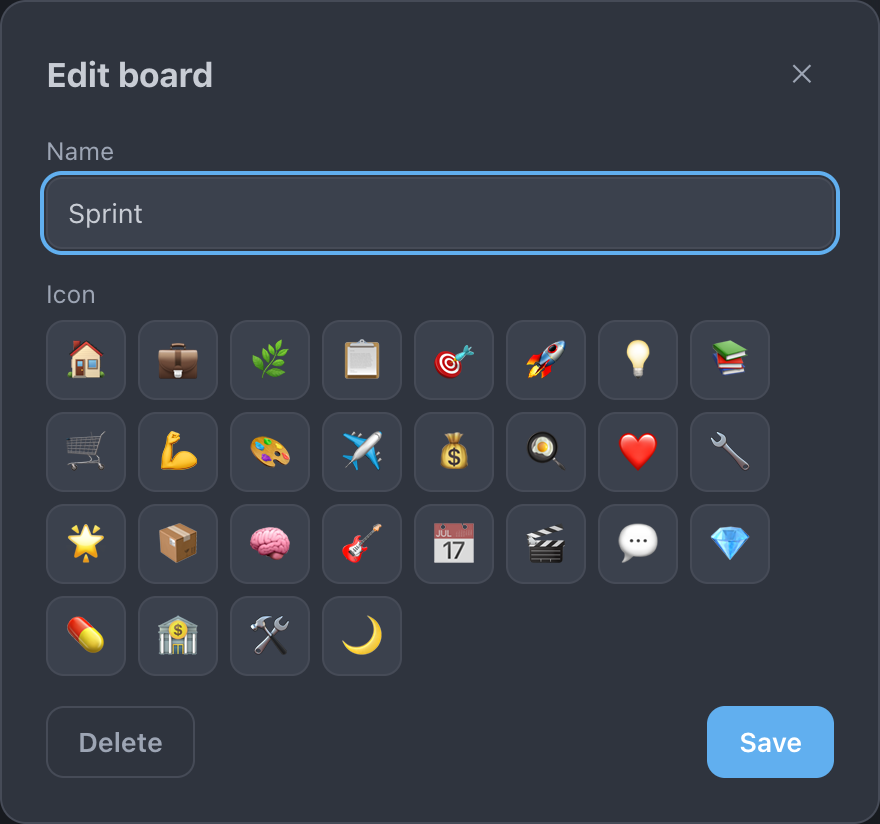<br><div align="center"><sub>Name a board and pick its emoji</sub></div></td>
</tr>
</table>

<sub>**Pinned & widgets:** drag any card into the right-edge Pinned list (or press **N**) to keep it
across boards. Below it, a four-slot **widget tray** holds a **Work clock** (analog dial with a 9–5
band counting down to 5 PM) and **Soundscapes** (Lofi · Ambient · Piano · Nature · Rain, real
internet-radio streams with an offline synth fallback). Rearrange them in **Manage widgets**.</sub>

<table>
<tr>
<td width="40%" valign="top">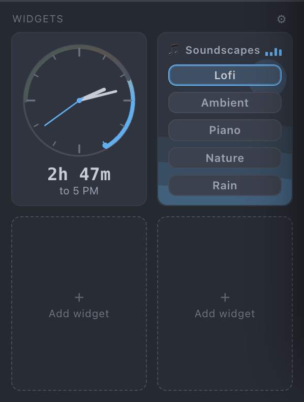<br><div align="center"><sub>Work clock + Soundscapes</sub></div></td>
<td width="60%" valign="top">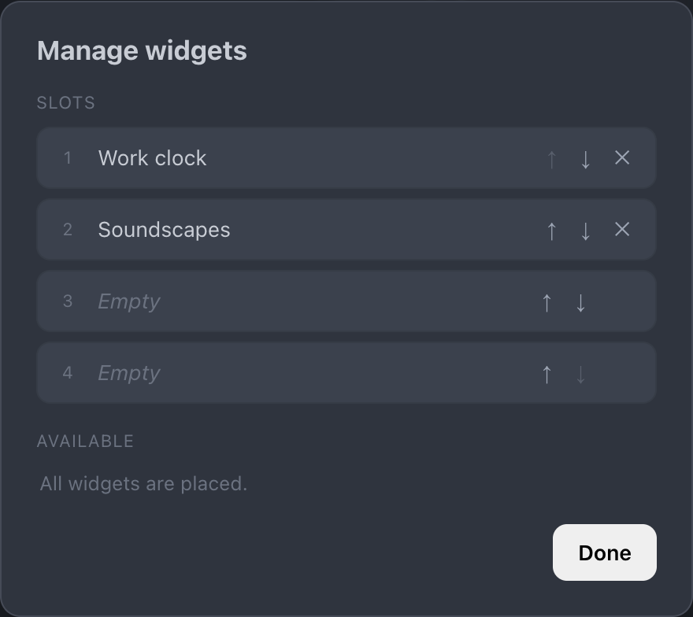<br><div align="center"><sub>Manage widgets — add, remove, reorder the four slots</sub></div></td>
</tr>
</table>

---

## 💡 Ideas

A free-form, infinitely pannable/zoomable canvas of sticky notes, à la Apple Freeform. Double-click
(or **+ Note**) to drop one, drag it anywhere, resize it, and type inline. Six note types — **Sticky,
Idea, To-do, Question, Highlight, Plain** — each its own colour.

<table>
<tr>
<td width="62%" valign="top">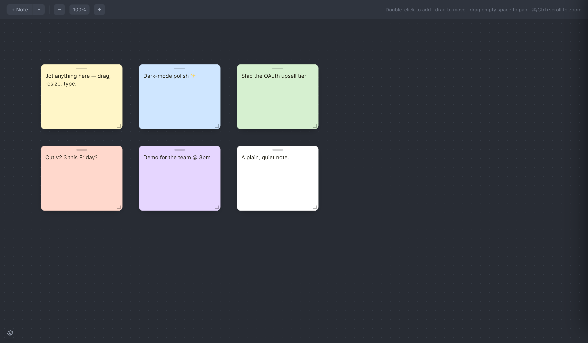</td>
<td width="38%" valign="top">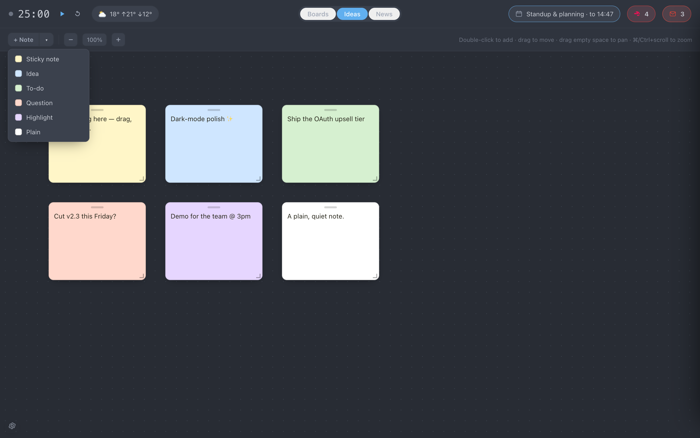<br><div align="center"><sub>Pick a note type from <b>+ Note ▾</b></sub></div></td>
</tr>
</table>

<sub>Pan by dragging empty canvas; **⌘/Ctrl + scroll** (or the **− / + / %** controls) to zoom 25 %–250 %.
Saved per device and included in [backups](#-backup--restore).</sub>

---

## 📰 News

A developer-news feed aggregating the **Hacker News** front page and **Dev.to** top articles into a
three-column grid, newest first. Filter by source, refresh, and — with an Anthropic key — **Summarize**
any story into a one-to-two-sentence plain-English blurb on demand.

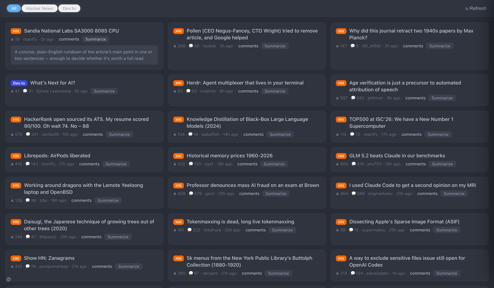

<sub>Both sources are keyless public APIs fetched straight from the page and cached ~15 min, so the
feed shows instantly. Nothing here is stored in backups.</sub>

---

## 🎨 Themes & appearance

Open settings (gear, bottom-left) → **Appearance**. Nine base themes — `System` (follows your OS),
`Dark`, `Dark (High Contrast)`, `Light`, `Midnight (OLED)`, `Sepia`, `Solarized Dark`,
`Solarized Light`, and `Zed (One Dark)` — plus nine accent colors (`Ember`, `Ocean`, `Violet`,
`Forest`, `Rose`, `Amber`, `Crimson`, `Teal`, `Graphite`). The break phase always uses sage green so
you can tell focus from break at a glance. The choice is per-device and applies instantly.

<table>
<tr>
<td width="20%">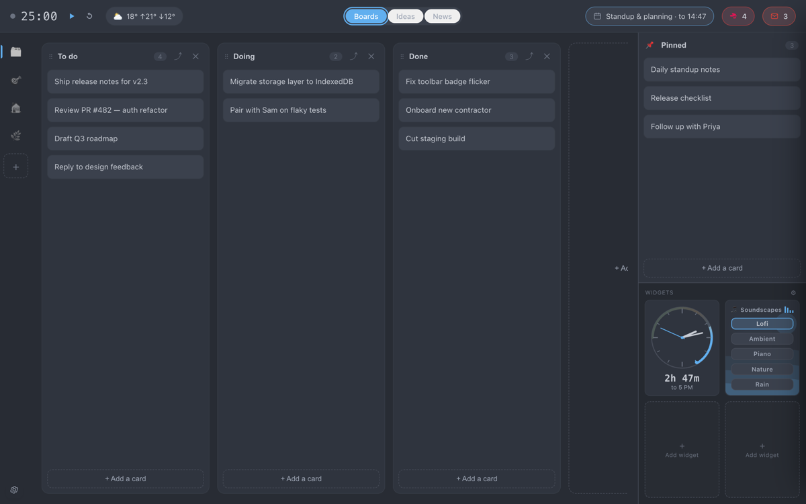<br><div align="center"><sub>Zed (One Dark)</sub></div></td>
<td width="20%">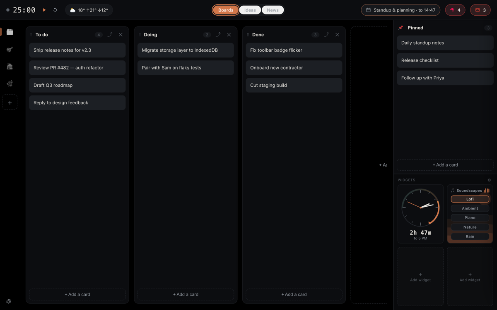<br><div align="center"><sub>Midnight (OLED)</sub></div></td>
<td width="20%">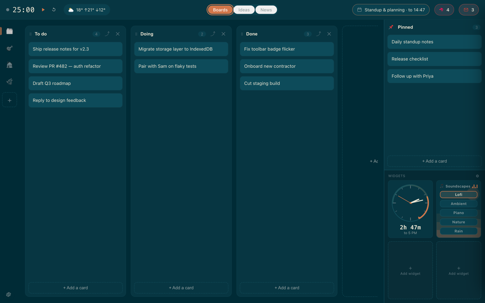<br><div align="center"><sub>Solarized Dark</sub></div></td>
<td width="20%">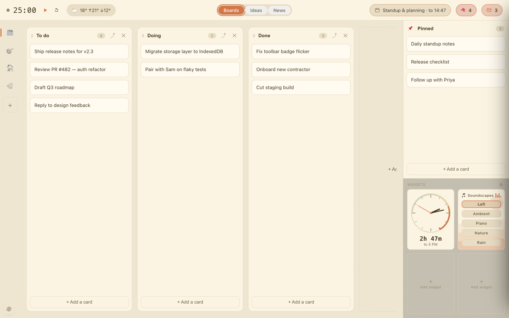<br><div align="center"><sub>Sepia</sub></div></td>
<td width="20%">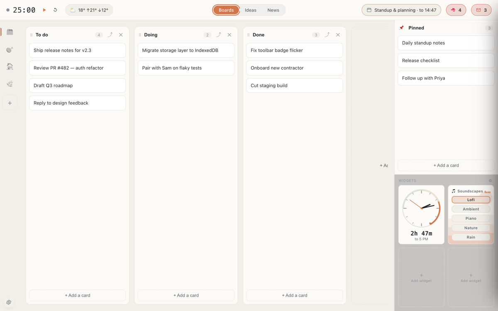<br><div align="center"><sub>Light</sub></div></td>
</tr>
</table>

<div align="center"></div>

---

## 🌐 Language

DevCockpit is fully bilingual — **English** and **Polski (Polish)**. Settings (gear, bottom-left) →
**Appearance** → **Language**. The entire interface — top bar, the Boards / Ideas / News views,
every settings tab, dialogs, drawers, empty states, even the timer and Slack desktop notifications —
switches **instantly, with no reload**.

- **Auto-detected on first run.** New installs follow your browser language: Polish if Chrome is set
  to Polish, English otherwise. Change it whenever you like; the choice is per-device and syncs
  across open tabs.
- **Your content stays yours.** Board names, cards, and Ideas notes are never translated — only the
  app's own chrome is. (The Slack panel's AI buttons stay intentionally bilingual: explain in Polish,
  reply in English.)

| | English | Polski |
|---|---|---|
| Views | Boards · Ideas · News | Tablice · Pomysły · Wiadomości |
| Timer | Focus · Break | Skupienie · Przerwa |
| Settings tabs | Timer · Integrations · Appearance · Backup | Minutnik · Integracje · Wygląd · Kopia zapasowa |

---

## 🚀 Install (unpacked)

1. Open `chrome://extensions`, turn on **Developer mode**.
2. Click **Load unpacked** and pick this folder (the one with `manifest.json`).
3. Click the toolbar icon — the full page opens in a new tab.

The extension ships a fixed key in `manifest.json`, so it always loads under the same ID,
**`aiegllbeihjbphiilgeifggceklfffkn`** — the ID the Google OAuth client is bound to.

---

## 🔌 Set up the integrations

Everything works offline out of the box. These add the live pills, and each is opt-in. Settings
(gear) → **Integrations**.

<div align="center">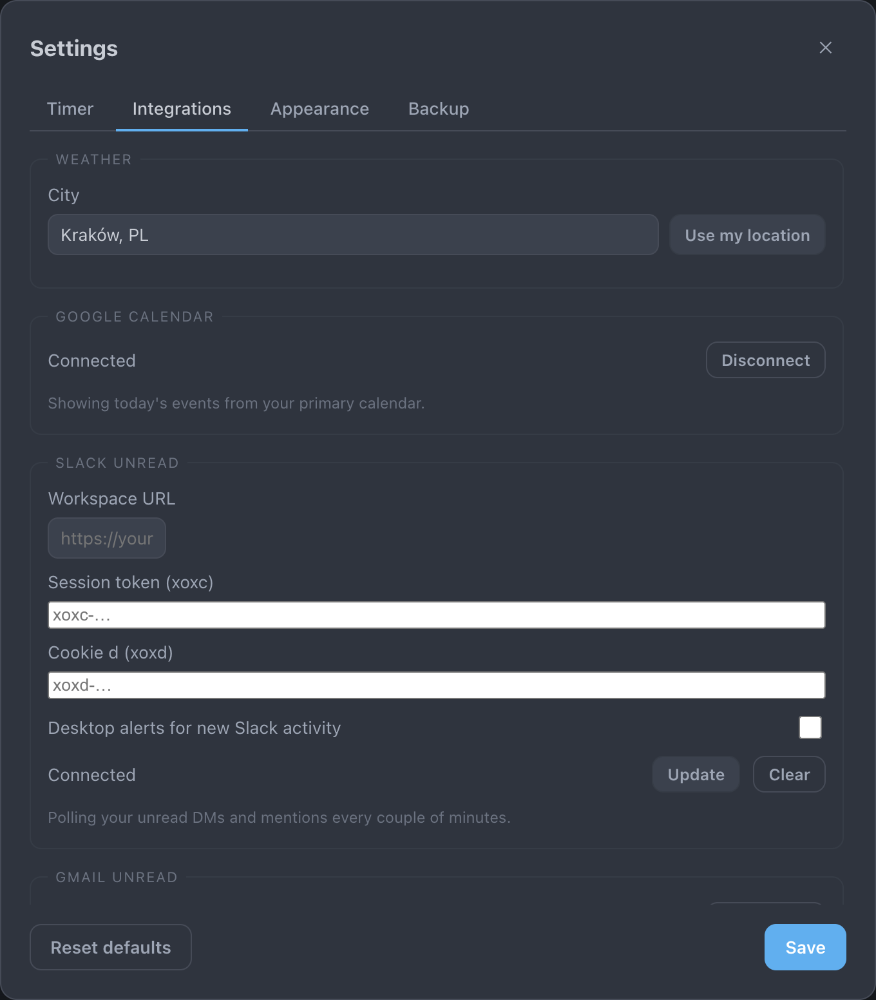</div>

<details>
<summary><b>Weather</b> — keyless, instant</summary>

&nbsp;

Type a city, or click **Use my location**. Data comes from Open-Meteo (no API key), refreshes every
30 minutes, and is cached locally so the pill is populated immediately on open.
</details>

<details>
<summary><b>Google Calendar</b> & <b>Gmail</b> — one-time OAuth client (free)</summary>

&nbsp;

Calendar and Gmail use Google's official API via Chrome's identity flow. You need your own OAuth
client (free), reused by both:

1. **Google Cloud Console** → create or pick a project.
2. **APIs & Services → Library** → enable **Google Calendar API** (and **Gmail API** for the unread pill).
3. **OAuth consent screen** → External → add your Google account under **Test users**, and add scopes
   `calendar.readonly` and (for Gmail) `gmail.metadata`.
4. **Credentials → Create credentials → OAuth client ID** → application type **Chrome extension** →
   Item ID: `aiegllbeihjbphiilgeifggceklfffkn`.
5. Copy the generated **Client ID** (`…apps.googleusercontent.com`), put it in `manifest.json` →
   `oauth2.client_id`, save, and reload the extension.
6. Settings → Integrations → **Connect** under Google Calendar and/or Gmail, and approve.

Each scope is requested only when you connect that feature. Gmail uses the read-only `gmail.metadata`
scope, which exposes label counts and **never** message contents.
</details>

<details>
<summary><b>Slack unread</b> — paste a session token (unofficial)</summary>

&nbsp;

The Slack pill shows one number — unread **DMs + @mentions** — by reading Slack's internal
`client.counts` endpoint, the same one the web app polls. It needs a browser-session token, so you
paste two values from a logged-in Slack web session (no Slack app to create).

In Chrome, open `https://<your-team>.slack.com`, then DevTools (⌥⌘I):

1. **Session token (`xoxc-…`)** — Console: `JSON.parse(localStorage.localConfig_v2).teams` → copy your team's `token`.
2. **Cookie `d` (`xoxd-…`)** — Application → Cookies → your Slack URL → copy the value of the cookie named **`d`**.

Then settings → Integrations → **Slack unread** → paste the workspace URL, token, and cookie → **Connect**.

> ⚠️ This is an **unofficial** method. The tokens grant **full access to your Slack account**, they
> **reset when you log out** of Slack web (just re-paste), and they're stored only in this device's
> local extension storage. Enterprise Grid workspaces may not work. Use **Clear** to remove them.
</details>

<details>
<summary><b>AI helpers (Anthropic)</b> — Slack explain/reply + News summaries</summary>

&nbsp;

Settings → Integrations → **AI (Anthropic)**: paste your key (`sk-ant-…`), **Save key**, and pick a
model — **Claude Haiku 4.5** (fast & cheap, default) or **Claude Sonnet 4.6** (smarter). This powers
the Slack **Wyjaśnij (PL)** / **Odpowiedz (EN)** buttons and the News **Summarize** button.

The key is stored only in this device's local storage — never backed up, logged, or echoed into the
field. Calls go straight from the service worker to `api.anthropic.com`. Use **Clear** to remove it.
</details>

---

## 💾 Backup & restore

Your boards live in this device's local storage, so DevCockpit keeps backups for you. Settings (gear)
→ **Backup**.

<div align="center">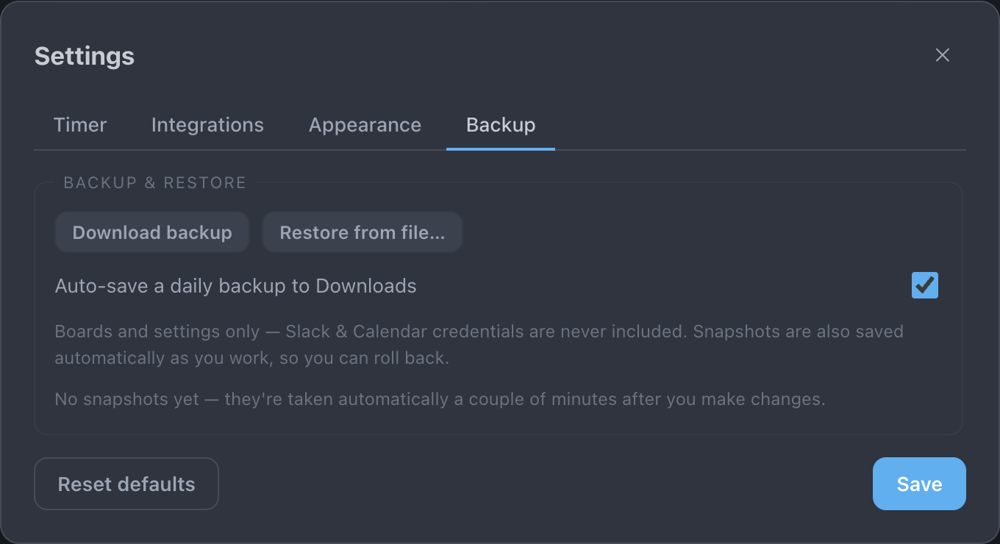</div>

- **Download backup** writes a `devcockpit-backup-YYYY-MM-DD.json` — a snapshot of all boards, the
  pinned list, the Ideas canvas, and settings.
- **Restore from file…** validates the file, confirms, and snapshots your current state first, so a
  restore is undoable.
- **Auto-save a daily backup** (on by default) writes that file once a day, only when something changed.
- **Recent snapshots** — a rolling history (last 10) captured automatically; hit **Restore** to roll back.

Backups contain **boards, the pinned list, the Ideas canvas, and settings only**. Slack, Google, and
Anthropic credentials — and the cached News feed — are never written to a backup.

---

## 🛠️ How it works

A zero-dependency Manifest V3 extension — plain ES modules and vanilla DOM, **no build step, no
framework, no npm install**. Clone it, load it unpacked, and it runs.

```
manifest.json        MV3 manifest — permissions, OAuth client, CSP, stable extension key
background.js        Service worker — timer, badge, chime, notifications, Slack polling, AI, backups
app.html/.js/.css    Full-page UI — views (Boards · Ideas · News), timer, pinned list, widgets, panels
slack.js             Slack client.counts reader (imported by the worker)
news.js              Hacker News + Dev.to fetchers/normalizers (imported by the page)
anthropic.js         Anthropic Messages API client (imported by the worker)
backup.js            Shared JSON backup format + helpers
offscreen.html/.js   Plays the chime when no tab is open
icons/ screenshots/  Extension icons · README images
```

The **service worker owns time** — phase transitions, the toolbar badge, the chime and notifications
fire on `chrome.alarms`, so they're on time even with no tab open. It also polls Slack in the
background and runs the AI calls. The page reflects state from `chrome.storage.local`. Working on the
code? See [CLAUDE.md](CLAUDE.md) for architecture notes and constraints.

**Permissions** (in `manifest.json`): `storage`, `alarms`, `offscreen` (the chime), `notifications`,
`identity` (Google sign-in), `cookies` (the Slack `d` cookie), and `downloads` (backups). Host access
is limited to Open-Meteo, Google APIs, Slack, the Anthropic API, and the Hacker News (Algolia) and
Dev.to APIs.

---

## License

[MIT](LICENSE) © Dawid Nawrocki
