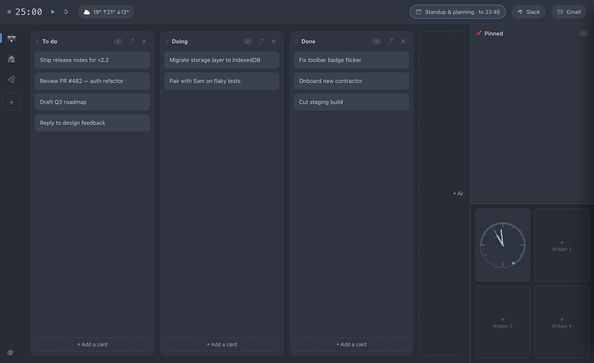
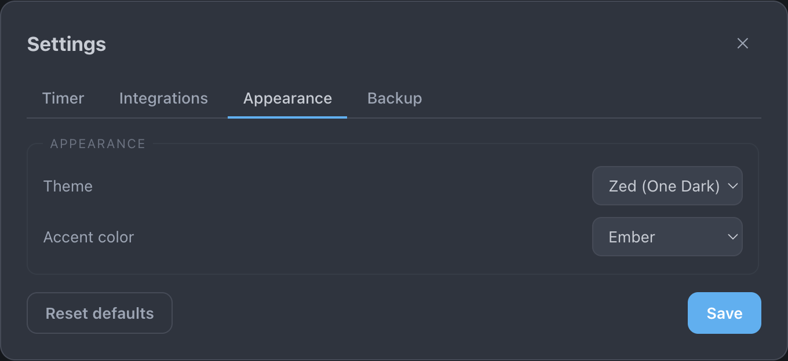

# DevCockpit — Board, Timer, Day

A board-first Chrome extension built to be your daily work surface. A slim top bar
carries a minimal Pomodoro timer, today's Google Calendar, the current weather, and your
Slack + Gmail unread counts — the rest of the screen is a Trello-style board. Everything
lives on one full-page tab that opens when you click the toolbar icon.

> Screenshots below use the built-in **Zed (One Dark)** theme. DevCockpit ships nine
> base themes and nine accent colors, and by default follows your system light/dark
> setting — see [Themes & appearance](#themes--appearance).

The slim top bar up close — Pomodoro timer and transport controls on the left; weather,
calendar, Slack and Gmail on the right:

## Highlights

- **Timer** lives in the top bar: just the number and three controls — start/pause, reset,
  and (in settings) the phase lengths. Focus ↔ break only (no long break). A chime plays at
  every phase transition (the pitch nudges down going into a break, up going back to focus).
  Remaining time shows on the toolbar icon — ember while focusing, sage during a break, grey
  when paused. Keyboard: **Space** start/pause · **R** reset · **S** skip phase.
- **Calendar** pill shows the ongoing or next meeting; click it for the full agenda for
  **today and tomorrow**, split into two sections. A meeting in progress gives the pill an
  accent outline.
- **Weather** pill shows the current temperature alongside the day's high (↑) and low (↓);
  click it for feels-like, high/low, and wind.
- **Slack** pill shows your combined unread count (DMs + @mentions); click it for the
  per-conversation breakdown. The count also shows on the toolbar icon when the timer is
  idle, and you can opt into a desktop alert on new activity.
- **Gmail** pill (to the right of Slack) shows your inbox unread count; click it for the
  unread message/thread breakdown and a link to open Gmail. Uses the same Google sign-in
  as Calendar with a read-only `gmail.metadata` scope (label counts only — never message
  contents), and you can opt into a desktop alert when new mail arrives.
- **AI helpers (optional)** — with your own Anthropic API key, the Slack panel adds two
  per-message buttons: **Wyjaśnij (PL)** explains a message in Polish, and **Odpowiedz (EN)**
  drafts a ready-to-send English reply you can copy. See [AI helpers](#ai-helpers-optional).
- **Board** fills the screen: lists and cards with drag & drop, add / rename / delete
  lists, add / edit / delete cards. Drag a card between lists, or grab a list by the **⠿**
  handle on its header to reorder the lists themselves left-to-right. Pressing **Enter**
  when adding a card saves it and keeps the input focused so you can add the next one
  immediately. Hover a card and press **C** to delete it. The **⤴** button on a list header
  moves that whole list (and its cards) to another board. Saved locally on this device.
- **Boards** — keep several boards (e.g. Work, Personal, Lifestyle). A rail of small board
  icons sits on the **left** edge, one under another. Click an icon to switch boards; click
  the active icon again to rename it, change its emoji, or delete it. Use **+** to add one.
- **Pinned list** — a single list docked on the **right** edge that stays visible on
  **every** board. Drag cards into it from any board (or back out), so anything you want to
  keep at hand follows you as you switch boards. Below it sits a small **widget tray** (see
  [Pinned list & widgets](#pinned-list--widgets)). The Slack, Gmail, Calendar and Weather
  panels float over the pinned list when opened.
- **Themes** — nine base themes (including **Zed / One Dark**, Solarized, Sepia, Midnight
  OLED and a high-contrast dark) plus nine accent colors, or follow your system setting.

## Install (unpacked)

1. Open `chrome://extensions`, turn on **Developer mode**.
2. Click **Load unpacked** and pick this extension folder (the one containing
   `manifest.json`).
3. Click the toolbar icon — the full page opens in a new tab.

The extension ships a fixed key in `manifest.json`, so it always loads under the same ID:
**`aiegllbeihjbphiilgeifggceklfffkn`**. That stable ID is what the Google OAuth client is
tied to (see below).

## Themes & appearance

Open settings (gear, bottom-left) → **Appearance**:

- **Theme** — `System` (follows your OS light/dark setting), `Dark`, `Dark (High Contrast)`,
  `Light`, `Midnight (OLED)`, `Sepia`, `Solarized Dark`, `Solarized Light`, and
  `Zed (One Dark)`. The screenshots in this README use **Zed (One Dark)**.
- **Accent color** — `Ember` (default), `Ocean`, `Violet`, `Forest`, `Rose`, `Amber`,
  `Crimson`, `Teal`, `Graphite`. The accent tints the focusing timer, the in-progress
  calendar pill, links and focus rings; the break phase always uses a sage green so you can
  tell focus from break at a glance.

The choice is stored per-device and applies instantly.

## Pinned list & widgets

The pinned list is docked on the right edge and shown on every board. Under its cards is a
four-slot **widget tray**:

- **Slot 1 — work clock.** An analog clock with a 9 AM → 5 PM band painted around the dial
  and a live countdown to 5 PM, so you can see how much of the workday is left at a glance.
- **Slots 2–4** are open placeholders for future widgets.

## Weather

Open settings (gear) → **Integrations** → **Weather** → type a city, or click
**Use my location**. Data comes from Open-Meteo (no API key). It refreshes every 30 minutes
and is cached locally so the pill is populated immediately on open.

## Google Calendar (optional, one-time setup)

Calendar uses Google's official API via Chrome's identity flow. You need your own OAuth
client (free). Steps:

1. Go to **Google Cloud Console** → create or pick a project.
2. **APIs & Services → Library** → enable **Google Calendar API** (and **Gmail API** if
   you also want the Gmail unread pill).
3. **OAuth consent screen** → External → add your own Google account under **Test users**,
   and add the scopes `calendar.readonly` and (for Gmail) `gmail.metadata`.
4. **Credentials → Create credentials → OAuth client ID** → application type
   **Chrome extension** → Application/Item ID:
   `aiegllbeihjbphiilgeifggceklfffkn`
5. Copy the generated **Client ID** (looks like `…apps.googleusercontent.com`).
6. Open `manifest.json`, replace `oauth2.client_id` value with your Client ID, save.
7. Reload the extension at `chrome://extensions`, then in settings → Integrations →
   **Google Calendar** → **Connect** and approve the read-only access.

Scopes requested are `calendar.readonly` and `gmail.metadata` — each is requested only
when you connect that feature, so connecting Calendar won't prompt for Gmail (or vice
versa). Until this is set up, the Calendar and Gmail pills just show a "connect in
settings" hint and the rest of the extension works normally.

## Gmail unread (optional)

The Gmail pill — to the right of the Slack badge — shows your **inbox unread count**. It
reuses the same Google OAuth client as Calendar (see above) but requests only the
read-only `gmail.metadata` scope, which exposes label counts and never message contents.

After the Google client is configured, open settings (gear) → **Integrations** →
**Gmail unread** → **Connect** and approve. The count refreshes every couple of minutes
while the tab is open; click the pill for the unread message/thread breakdown and a link to
open Gmail. Tick **Desktop alerts for new Gmail** to be notified when the unread count climbs.

## Slack unread (optional)

The Slack pill shows one combined number — unread **DMs + @mentions** — by reading
Slack's internal `client.counts` endpoint, the same one the Slack web app polls. Because
that endpoint only accepts a **browser-session token**, you paste two values from a logged-in
Slack web session (there is no Slack app to create).

In Chrome, open your workspace at `https://<your-team>.slack.com`, then DevTools (⌥⌘I):

1. **Session token (`xoxc-…`)** — Console tab, run:
   `JSON.parse(localStorage.localConfig_v2).teams` and copy your team's `token`.
   (Alternatively, copy the `token` form field from any `client.*` request in the Network tab.)
2. **Cookie `d` (`xoxd-…`)** — Application tab → Cookies → your Slack URL → copy the value of
   the cookie named **`d`**.

Then in DevCockpit: settings (gear) → **Integrations** → **Slack unread** → paste the
workspace URL, token, and cookie → **Connect**. The pill updates within a couple of minutes
and refreshes every ~2 min.

> ⚠️ This is an **unofficial** method. The tokens grant **full access to your Slack account**,
> they **reset when you log out** of Slack web (just re-paste), and they're stored only in this
> device's local extension storage. Enterprise Grid workspaces use a different endpoint and may
> not work. Use **Clear** in settings to remove the credentials and the `d` cookie.

## AI helpers (optional)

When you add an Anthropic API key, the Slack panel gains two buttons under each message:

- **Wyjaśnij (PL)** — a 1–3 sentence Polish explanation of what the message is about and
  what the sender wants.
- **Odpowiedz (EN)** — drafts a natural, professional English reply you can send as-is, with
  a **Kopiuj** (copy) button.

Set it up in settings (gear) → **Integrations** → **AI (Anthropic)**:

1. Paste your key (`sk-ant-…`) and click **Save key**.
2. Pick a model — **Claude Haiku 4.5** (fast & cheap, the default) or **Claude Sonnet 4.6**
   (smarter).

The key is stored only in this device's local extension storage and is never written to a
backup, never logged, and never echoed back into the field. Calls go directly from the
extension's service worker to `api.anthropic.com`. Without a key, the two buttons are
disabled and everything else works as normal. Use **Clear** to remove the key.

## Backup & restore

Your boards live in this device's local extension storage, so the extension keeps
backups for you. Open settings (gear) → **Backup** → **Backup & restore**:

- **Download backup** writes a `devcockpit-backup-YYYY-MM-DD.json` to your Downloads —
  a snapshot of all boards and settings you can keep or move to another machine.
- **Restore from file…** reads one back. It validates the file first, asks you to
  confirm, and snapshots your current state before overwriting so a restore is undoable.
- **Auto-save a daily backup to Downloads** (on by default) writes that same file
  automatically once a day, but only when something has changed — one file per day.
- **Recent snapshots** — a rolling history (last 10) is captured automatically a couple
  of minutes after you make changes, kept inside the extension. Hit **Restore** on any
  snapshot to roll back an accidental delete or edit.

Backups contain **boards and settings only**. Slack, Google, and Anthropic credentials are
never written to a backup file or snapshot — after a restore on a new machine you just
reconnect them once, as in first-time setup.

## How it works

- `background.js` (service worker) owns phase transitions, the toolbar badge, the chime
  and notifications via `chrome.alarms` — so they fire on time even with no tab open. It
  also polls Slack unread counts in the background and runs the AI calls.
- `slack.js` is the Slack `client.counts` reader (fetch + parse), imported by the worker.
- `anthropic.js` is the Anthropic Messages API client (imported by the worker) that powers
  the Slack panel's **Wyjaśnij (PL)** / **Odpowiedz (EN)** buttons.
- `app.html` / `app.js` / `app.css` is the full-page UI (timer, board, pinned list &
  widgets, calendar, weather, Slack, Gmail, settings). The Gmail inbox unread count is read
  app-side from the Gmail API `users.labels.get` (INBOX) using the `gmail.metadata` scope.
- `offscreen.html` / `offscreen.js` plays the chime when no tab is open.
- Storage is `chrome.storage.local` (this device only). `backup.js` defines the shared
  JSON backup format; the service worker takes rolling snapshots and the daily file
  export, and the settings panel offers manual download/restore (see **Backup & restore**).

## Permissions

Declared in `manifest.json`: `storage` (boards, settings, caches), `alarms` (timer &
background polling), `offscreen` (the chime), `notifications` (timer / Slack / Gmail
alerts), `identity` (Google sign-in), `cookies` (the Slack `d` cookie), and `downloads`
(backup files). Host access is limited to Open-Meteo, Google APIs, Slack, and the Anthropic
API.
